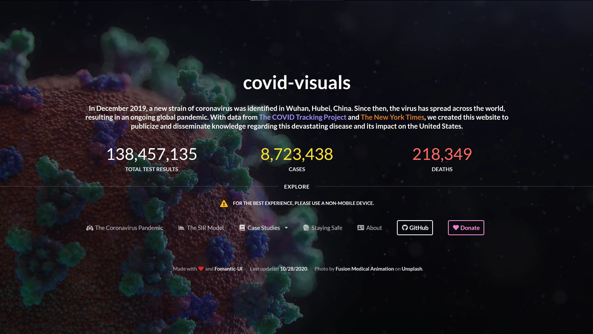

## covid-visuals

A project a few friends and I undertook in Summer 2020 to visualize and explain the COVID-19 pandemic and its impacts on the United States. I designed and built a website to present our findings from scratch and utilized Python to create data visualizations.

### Technologies used

- Python ([Plotly](https://plotly.com/python/) for visuals)
- HTML
- CSS ([Fomantic-UI](https://fomantic-ui.com/) + Custom Styles)
- Some [JS](https://marked.js.org/)
- And Markdown too

[Check it out!](https://covid-visuals.netlify.app/) It's also [open source on GitHub](https://github.com/vskbellala/covid-visuals).